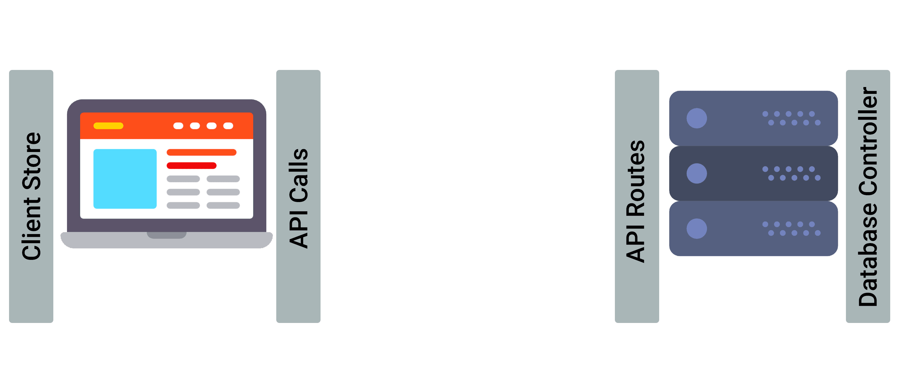
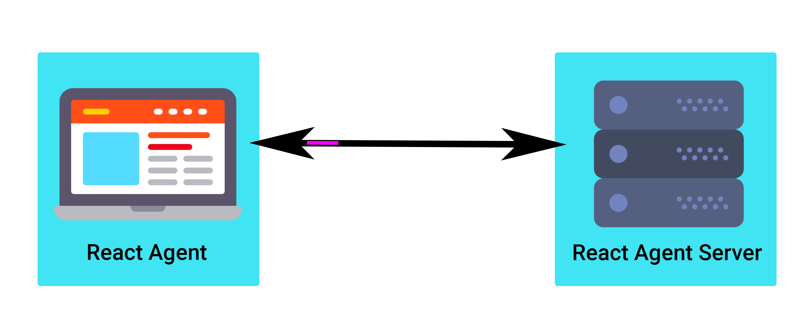

# React Agent Server

React Agent synchronizes client-side and server-side state.  It can be included in any React project without conflict with other state management tools or REST APIs.

React Agent is easy to learn.

Here's the basic idea: the client runs 'actions' that are defined on the server-side.

```javascript
run('addUser', {user: 'Billy'})
```

These actions can be as powerful as you want -- i.e. CRUD operations, API calls, and authentication. Moreover, clients can subscribe to server-side actions so that they  receive live updates.

React Agent includes offline-support to render optimistic updates and then synchronization on reestablished network connection. It also features time travel debugging.

*Why use React Agent?*

The popular conceptualization of state management stores state in two places: data on the client-side and data on the server-side.

To connect these, front-end and back-end developers usually write a lot of code such as HTTP requests, controllers, and routes. It can get complicated.


In contrast, React Agent serves as a communication channel between the client and the server. It abstracts state transfer to make it super easy to interact between the client and server.


# Getting Started

This guide is focused on server-side usage of React Agent, although it includes necessary details to know about client-side usage. See [React Agent](https://github.com/yokyak/react-agent/tree/master/packages/react-agent) for more information about client-side set-up.

## Installing

Install the package:

```bash
npm install react-agent-server --save
```

## How to use

First, `require` React Agent Server into your server-side script.

```javascript
const agent = require('react-agent-server');
```

The `agent` method is called with a server, queries and database object.

```javascript
const server = http.createServer(fn).listen(3000);

const actions = {
  getMessages: {
    action: 'SELECT * FROM posts'
  }
};

const database = {
  name: 'billy',
  user: 'billy-user',
  password: 'billy-pw',
  dialect: 'postgres',
  host: 'rabbit.db.elephantsql.com',
  port: 3421
};

agent(server, actions, database);
```
With this setup, whenever `run('getMessages')` is called from the client-side (via React Agent), the corresponding SQL query under the `action` property for `getMessages` will be ran ("SELECT * FROM posts").

Optionally, add `true` as the fourth argument of `agent` to log in the console what's happening under the hood. This feature can be helpful for debugging.

A callback can also be added to inspect and modify the direct response from the SQL database. Whatever is returned from this callback is what gets sent back to the client. Call `console.log` on the response to see the SQL results.

```javascript
const actions = {
  getMessages: {
    action: 'SELECT * FROM posts',
    callback: response => ({ messages: response[0] })
  }
};
```

In the event of a database error, a custom error message can be sent back to the client. The default error message is 'Error with database'.

```javascript
const actions = {
  getMessages: {
    action: 'SELECT * FROM posts',
    callback: response => ({ messages: response[0] }),
    errorMessage: 'Problem retrieving messages.'
  }
};
```

A `pre` property can be used to run any number of functions before the action is ran. This is an easy way to provide validation functions or modify the request object sent from the client in any way before it's passed to the action. Just return the request object and it will get passed into the next function. If any of these functions return false, the promise that the client-side `run` method returns will be rejected and the action will not run.

```javascript
login: {
    pre: [
      request => {
        if (request.cookie1 === '123') return request;
        else return false;
      },
      request => {
        if (request.cookie2 === '456') return request;
        else return false;
      }
    ],
    action: 'SELECT username, _id FROM users WHERE username = $user AND password = $password',
    callback: response => ({ username: response[0][0].username, id: response[0][0]._id })
  }
```

In the action above, two properties from our request object from the client will be injected into the SQL string by using `$` then the property name. For example, if the client-side `run` call looked like this:

```javascript
run('login', { user: 'Bob', password: 'superstrongpassword' })
```

Then the appropriate values with those property names will be injected into the SQL string. React Agent uses Sequelize under the hood, which handles input sanitization protecting against many different types of SQL injection attacks.

Arbitrary functions can also be ran instead of using a SQL query string. The function will be passed a `resolve` and `reject` argument (from a `new Promise` within the library), along with the request object passed in from the client-side `run` call. The use of a Promise makes dealing with asynchronous code in the action easy.

```javascript
const actions = {
  getPlanet: {
    action: (resolve, reject, request) => {
      const url = request.url;
      fetch(url, (error, response, body) => {
        if (error) reject(error);
        else resolve(body);
      });
    }
  }
};
```

## Contributors

### Authors

* **Tom Rosenblatt** - [https://github.com/tskittles](https://github.com/tskittles)

* **Eric Choi** - [https://github.com/eric2turbo](https://github.com/eric2turbo)

* **Henry Au** - [https://github.com/hhau01](https://github.com/hhau01)

* **Andrew Harris** - [https://github.com/didrio](https://github.com/didrio)

## License

This project is licensed under the MIT License - see the [LICENSE.txt](./../../LICENSE.txt) file for details.
